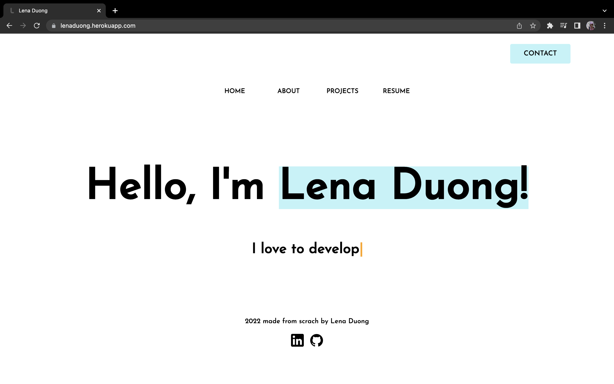
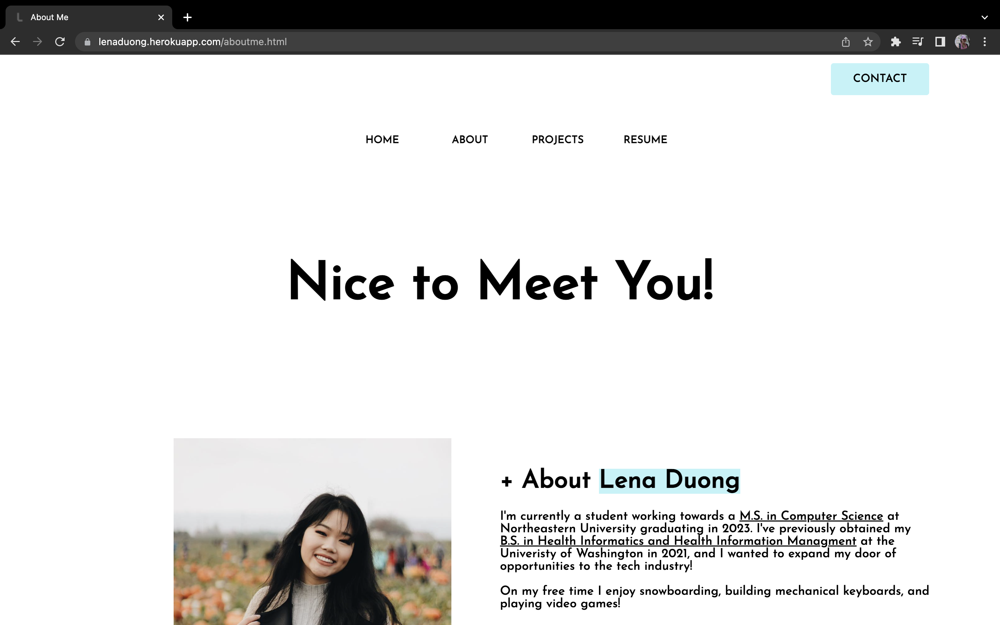
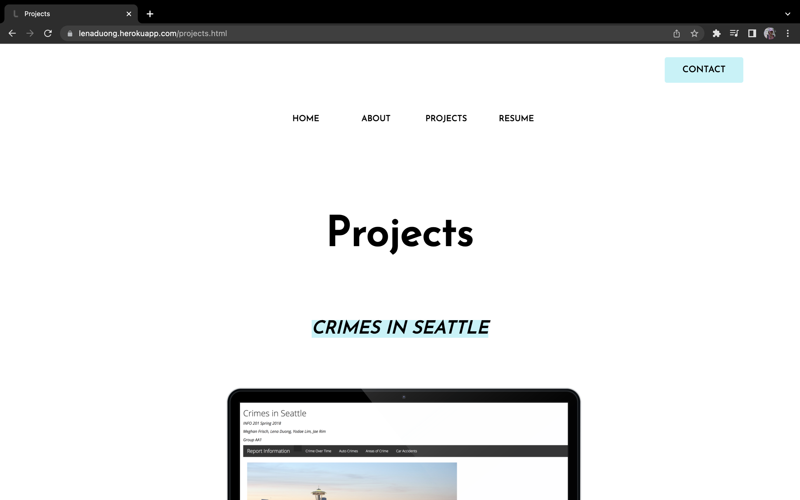
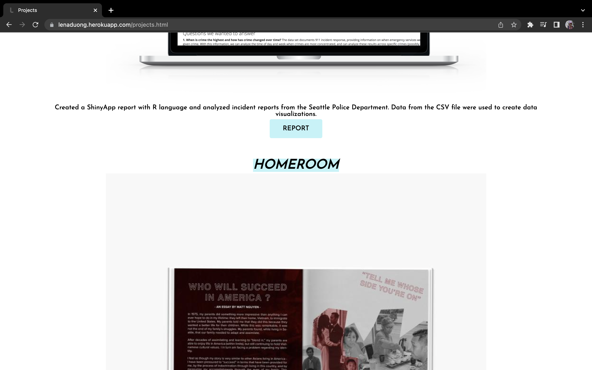

# PersonalWebsite-LenaDuong

Lena Duong's personal website that showcases her work experience and a little bit about her!
This website is made from scratch using vanilla JS, HTML, and CSS.

Click [here](https://lenaduong.herokuapp.com) to go to my personal website. 

## Landing Page

## About Page

## Projects Page

### Meeting The Requirements
- [x] Landing page is defined in the index.html
- [x] Footer is included and navigation bar
- [x] Internal links can be defined as the "projects" and "about" pages found through the navigation bar.
- [x] External linkes can be found in the footer (linkedin and github), and "resume" on the navigation bar.
- [x] HTML table is found on the "projects" page.
- [x] Animated component can be found on the landing page where there's a typewriter animation, the "contact" button at the upper right, and the buttons within the "projects" page. Mouseover interactions are also found on the navigation bar links.
- [x] Visuals are mobile compatible.